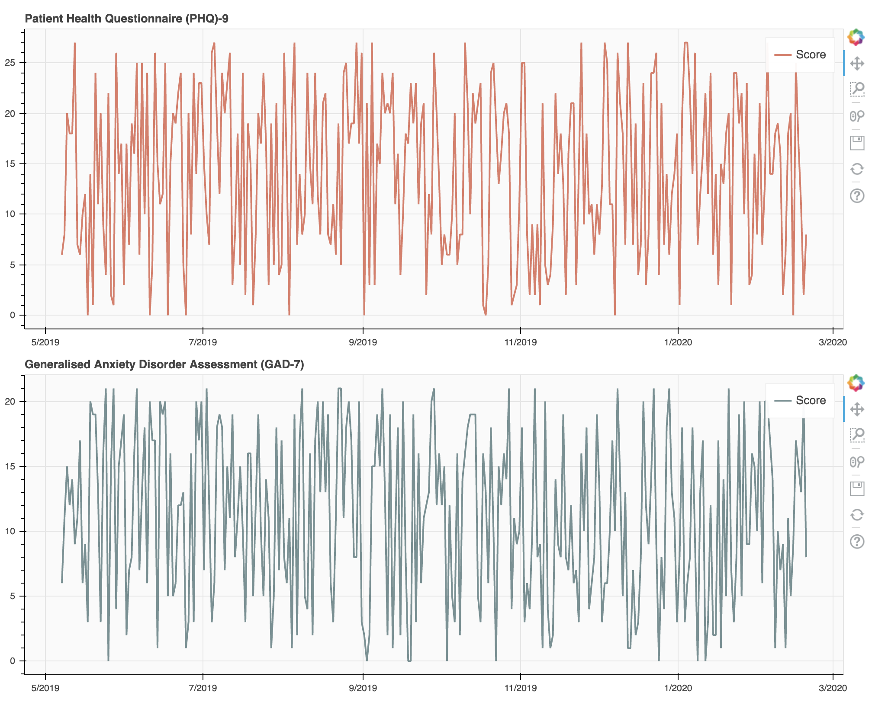

[](https://circleci.com/gh/chrishannam/hippocrates/tree/master)

# Hippocrates
A Python library for giving and scoring various health based questionnaires.

Currently the following are supported:
* [Beck Depression Inventory](https://en.wikipedia.org/wiki/Beck_Depression_Inventory)
* [Generalized Anxiety Disorder 2](https://en.wikipedia.org/wiki/Generalized_anxiety_disorder)
* [Generalized Anxiety Disorder 7](https://en.wikipedia.org/wiki/Generalized_Anxiety_Disorder_7)
* [Patient Health Questionnaire 2](https://en.wikipedia.org/wiki/Patient_Health_Questionnaire#2-item_depression_screener)
* [Patient Health Questionnaire 9](https://en.wikipedia.org/wiki/PHQ-9)
* [Rosenberg Self-Esteem Scale](https://en.wikipedia.org/wiki/Rosenberg_self-esteem_scale)
* Mood - Generic scoring from 1 to 10 of current mood.

More information about the above tests can be found in [questionnaires](docs/questionnaires.md).

# Installing
## Pip
`pip install hippocrates`

## From Source
```
git clone https://github.com/chrishannam/hippocrates.git
cd hippocrates
python setup.py install
```


# Using the Questionnaires
Once installed, the questionnaires are available via the `hippocrates` command:

`hippocrates QUESTIONNAIRE_NAME`

e.g.
`hippocrates phq9`

Below is the list of the supported questionnaires:
* `beck_depression_index`
* `gad2`
* `gad2`
* `phq2`
* `phq9`
* `rosenberg_self_esteem`
* `mood`

## Options

### --hide
Stops results from being displayed once questionnaire is created, default is `off`.

### --log
Logs results to ~/.hippocrates/results.csv, default is `off`.

### questionnaire
Selected questionnaire to complete.


# Reporting
Using `--log` outputs your results in a csv file stored locally in you
home directory called `.hippocrates`. A sample is listed below:

```
2019-01-21 13:12:38,gad7,15
2019-02-21 13:17:38,phq9,14
2019-03-22 13:12:38,gad7,3
```

## hippocrates-results
Use the command `hippocrates-results` to create a local `html` file
called `hippocrates_results.html`.

This file will be opened in your browser to display your results as a
basic graph:


